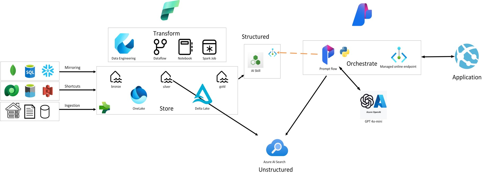
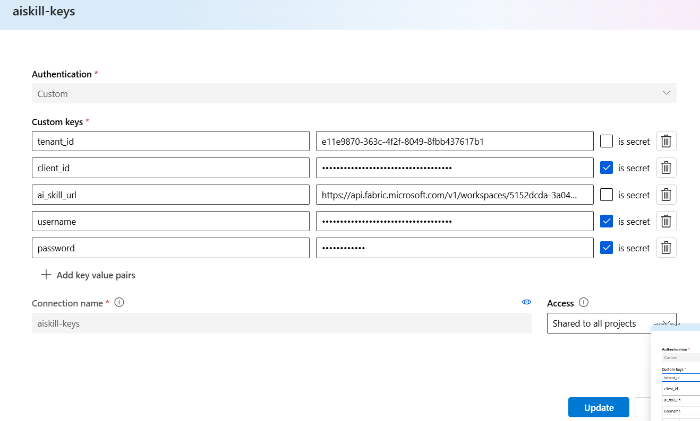

# Structured and Unstructured Fabric Data in Promptflow in Azure AI

## Overview
This repository contains a prompt flow that grounds answers based on structured and unstructured data from Fabric. The structured data is queried through a Fabric AI Skills Endpoint, while the unstructured data comes from Azure AI Search.

The prompt flow is built on the following architecture:

This architecture was presented at the Fabric Conference in Stockholm during a session called [Building a custom Q&A bot on your Fabric data with AI Studio](https://www.sharepointeurope.com/events/building-a-custom-qa-bot-on-your-fabric-data-with-ai-studio/).

## Features
- **Azure AI Integration**: Utilizes Azure AI services for natural language processing and understanding.
- **Structured Data Handling**: Efficiently processes and retrieves information from structured data sources.
- **Unstructured Data Handling**: Capable of understanding and extracting information from unstructured data.
- **Prompt Flow**: Implements a sophisticated prompt flow to manage conversations and ensure coherent interactions.

## Getting Started

### Prerequisites
- Azure subscription
- Fabric F64 license
- Knowledge of Azure and Fabric L100/L200
- Git

### Configuration
1. Create a Fabric Lakehouse using your preferred method.
2. Set up your Azure AI environment in the Azure portal:
    - Create an Azure AI resource in your Azure portal.
    - Create an Azure AI project within your Azure AI resource.
    - Create Azure AI Search in your Azure portal.
3. Create the connections and deploy the models in Azure AI:
    - Create a data connection to the Lakehouse from AI Studio on the 'Data' page on the left pane.
    - Create a connection to AI Search from AI Studio on the 'Connections' page at the Hub level.
    - Deploy an embeddings model (e.g., text-embedding-ada-002) on the 'Deployments' page on the left pane.
    - Deploy a GPT model (e.g., gpt-4o-mini) on the 'Deployments' page on the left pane.
4. Import the data into Fabric:
    - Import structured data into the Gold Lakehouse [according to this documentation](https://learn.microsoft.com/en-us/fabric/data-science/ai-skill-scenario#create-a-lakehouse-with-adventureworksdw).
    - Import the unstructured data into the bronze layer located in `data/unstructured`.
    - Convert the unstructured data to markdown using the Notebook in the `src/markdown-pdf` folder.
5. Create the AI Skill:
    - Follow the instructions as [described in the Microsoft Documentation](https://learn.microsoft.com/en-us/fabric/data-science/ai-skill-scenario#create-an-ai-skill).
6. Create the search index:
    - In your AI project in AI Studio, navigate to 'Indexes' in the left pane.
    - Click 'Create new index'.
    - Use the "Data in Azure AI Studio" and select the previously created connection to the Fabric data.
    - Use the connection to the AI Search you set up earlier.
    - Use the embedding model to create a vector embedding.
7. Import the prompt flow:
    - Create a new prompt flow in the AI Studio UI and select 'Upload from local'.
    - Select the `src\Structured + Unstructured AI Skill` folder and import it into prompt flow.
    - Ensure all connections in the prompt flow are rechecked after import.
8. Connect AI Skill:
    - In the 'Connections' pane in the AI Studio Hub, create a 'custom connection'.
    - Add the following variables to the custom connection:
    
9. Test and debug the AI Skill:
    - When ready, deploy it to an endpoint and start interacting through the API endpoint.

## Project Structure
- `src/`: Contains the source code for the prompt flow and a notebook to convert PDFs to markdown.
- `data/`: Includes structured and unstructured data samples.
- `README.md`: Project documentation.

## Contributing
Contributions are welcome! Please read the contributing guidelines for more details.

## License
This project is licensed under the MIT License. See the LICENSE file for details.

## Acknowledgements
- Azure AI
- Microsoft
- Fabric Conference Sweden September 2024
- Fabric AI Product Marketing Management Team

## Contact
For any questions or suggestions, please use the Issues section.
